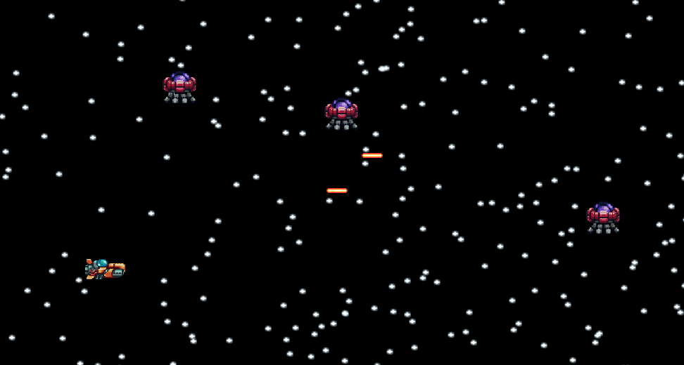

# 🚀 Nave Espacial - Meu Primeiro Jogo em Java

Este é o meu primeiro jogo feito em **Java**, desenvolvido como parte dos meus estudos. Foi uma experiência **desafiadora e divertida**, na qual aprendi muito sobre lógica, interface gráfica e programação orientada a objetos.

O projeto foi desenvolvido utilizando a **IDE Eclipse**, com a biblioteca padrão do Java (Swing) para interface gráfica.

---

## 🎮 Sobre o Jogo

Você controla uma nave espacial que deve sobreviver e eliminar inimigos pelo espaço. O jogo conta com movimentação, disparos e colisões simples entre naves.

---

## 🛠️ Funcionalidades Atuais

- Nave controlável com teclado
- Disparo de projéteis
- Inimigos com movimento aleatório
- Detecção de colisões
- Modo turbo (visual alternativo da nave)

---

## 🌟 Melhorias Futuras

- 🔊 Adicionar sons (disparo, explosão, fundo)
- 👾 Novos tipos de inimigos
- ❤️ Sistema de vidas / pontuação

---

## 🖼️ Imagem de exemplo



---

## ▶️ Como iniciar o jogo

Para jogar, você precisa ter o **Java JDK 21** instalado na sua máquina.  
Você pode baixar a versão mais recente aqui:  
👉 [https://jdk.java.net/21/](https://jdk.java.net/21/)

### Executar o jogo via terminal (Bash ou Prompt de Comando)

1. Baixe ou clone este repositório:

   ```bash
   git clone https://github.com/GabiCodings/NaveEspacial.git
   cd NaveEspacial/Jogo\\ Executavel
   ```

2. Verifique se você tem o Java instalado (versão 21 ou superior):

   ```bash
   java -version
   ```

3. Inicie o jogo com o comando:

   ```bash
   java -jar NaveEspacial.jar
   ```

> **Importante:** Certifique-se de que a **pasta `res/` esteja no mesmo diretório do `.jar`**, como já está na pasta `Jogo Executavel`, para que as imagens carreguem corretamente durante o jogo.

---

## 📌 Informações Técnicas

- Linguagem: **Java**
- IDE: **Eclipse**
- Interface: **Swing**
- Organização em pacotes e classes orientadas a objetos

---

## 🙋‍♀️ Desenvolvedora

**Gabriela Schumacher**  
📍 Brasil  
🔗 [Meu LinkedIn](https://www.linkedin.com/in/gabriela-schumacher-neves/)

---

> Obrigada por visitar o repositório! Fique à vontade para dar sugestões ou acompanhar a evolução do projeto.
> """
